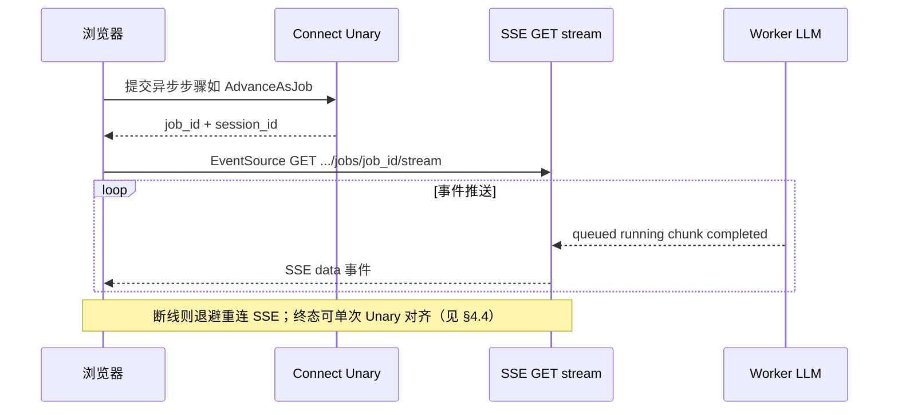

# 辩论与代码生成 — 异步任务与事件流设计

> **本文档是后续代码实施的依据与约束。**  
> 实现「POST 快速返回 `job_id` + SSE 收事件」须严格按本文与 **`docs/接口与数据流架构约定.md`** 执行；**禁止**以 WebSocket 或新增 REST 资源面实现本方案；**禁止**将轮询作为首路径。

---

## 1. 背景与目标

| 问题 | 目标 |
|------|------|
| 边缘网关（如 Cloudflare）对**长时间挂起的 Unary** 易返回 **524**，用户看不到生成结果 | 将「触发 LLM / 代码生成」与「等待完成」**解耦**：首包尽快结束 HTTP 事务。 |
| 用户需要**进度与完成态**的连续反馈 | 以 **SSE 事件流**为主路径推送；失败时 **重连 SSE**（退避）；**禁止**用 Unary 周期轮询模拟流式增量。 |
| AntTrader 为 **Web + 自有后端** | 浏览器侧使用 **`EventSource`（GET + `text/event-stream`）**；提交任务使用 **Connect Unary**（或既有 RPC 的异步变体），与全栈 **Connect / gRPC / SSE** 约定一致。 |

---

## 2. 范围（首期 + 二期 — 已交付）

| 纳入 | 说明 |
|------|------|
| **Advance：agent kickoff / 首次代码生成** | `StartDebateV2AdvanceJob` + `GET .../advance-jobs/{job_id}/stream`；Unary `AdvanceDebateV2` 保留无 LLM 的步进。 |
| **拒绝并重写代码** | `StartDebateV2RejectCodeJob`（入参同 `RejectDebateV2CodeRequest`）返回 **`StartDebateV2AdvanceJobResponse`**，与 advance **共用** `advance-jobs` SSE 与 `GetDebateV2AdvanceJob`；Unary **`RejectDebateV2Code`** 保留兼容。 |
| **辩论会话 Chat（含澄清意图）** | **`PrepareDebateV2ChatJob`**（落库用户句 + 建 `job_id`，**不**起 LLM）→ 浏览器 **`EventSource`** 订阅 **`GET .../chat-jobs/{job_id}/stream`** → **`RunDebateV2ChatJob`**（仅 `job_id`，**再**异步流式推理）+ `GetDebateV2ChatJob`；`intent` / `agent:*` 多轮；Unary **`ChatDebateV2`** 保留兼容。 |

**不在本设计交付范围**：行情 `StreamService` 等既有 Connect 流；**多副本**下跨进程 Job 事件（见 §5 当前限制）；**SSE `Last-Event-ID` 重放**（列为 §4.5 演进）。手工与回归要点见 **`docs/辩论与代码生成二期验收说明.md`**。

---

## 3. 总体流程（逻辑）

---

## 4. 接口形态（约束级约定）

### 4.1 提交任务（Connect Unary）

- 使用 **Connect RPC** 定义「提交」操作，响应体在**毫秒级**内返回，至少包含：  
  - `job_id`（全局唯一）  
  - `session_id`（辩论会话）  
  - 可选：`replay_after_seq`（用于 SSE 断线重放，若实现）  
- **不得**在该 Unary 内等待 LLM 完成后再返回。

> **具体 RPC 名、message 字段** 在 `.proto` 变更时须与本节同步更新；未更新文档不得合并 proto。

#### 4.1.1 辩论 Chat 两阶段 Unary（消除「先返回 job_id、后连 SSE」与 LLM 起协程的竞态）

**问题**：若单条 Unary 在返回 `job_id` 的**同一时刻**即 `go` 启动流式推理，浏览器往往在 **Unary 响应到达后才** 建立 `EventSource`，易错过前几段 delta，退化为一次 catch-up 大块，观感非流式。

**约定（主路径，与 Cursor 类体验对齐）**：

1. **`PrepareDebateV2ChatJob(ChatDebateV2Request)`** → `job_id` + `session_id`。服务端：校验步进、写入本轮 `v2_user`、创建 Job，**phase=`queued`**，**不得**调用 LLM。  
2. **浏览器**：在拿到 `job_id` 后**立即** `new EventSource(.../chat-jobs/{job_id}/stream)`（可与步骤 3 并发，但 **SSE 的 `open` 须不晚于** 服务端开始写首段模型流）。推荐顺序：`Prepare` → `EventSource`（`waitChatJob` 内同步 `open`）→ **`RunDebateV2ChatJob({ job_id })`**。  
3. **`RunDebateV2ChatJob(RunDebateV2ChatJobRequest)`** → `google.protobuf.Empty`。服务端：校验归属与 **phase 必须为 `queued`**，将 phase 置为 `running`、推送 `running` 事件，再 **`go` 执行**原有 `invokeStep` 流式逻辑；**禁止**对同一 `job_id` 重复成功执行 Run（第二次须失败，如 `FailedPrecondition`）。  
4. **降级**：Unary **`ChatDebateV2`** 仍为同步整段回复，不参与上述 Job/SSE 链；简单客户端可继续用，但不保证流式观感。

### 4.2 事件流（SSE，主路径）

- **浏览器**：使用 **`EventSource`** 连接 **仅支持 `GET`** 的 SSE URL（标准限制），响应头 **`Content-Type: text/event-stream`**。  
- **语义**：该 URL **仅**用于订阅 **某一 `job_id` 的事件流**，**不得**扩展为通用 REST 资源集合；**不属于**「禁止的 REST API 面」（见 `docs/接口与数据流架构约定.md` 对 SSE 的说明）。  
- **已注册路径**（与后端 `ServeMux` 一致；网关须同等转发并关闭缓冲）：  
  - **Advance 与拒绝重写代码**（kickoff / 首次或再次代码生成）：`GET /antrader/sse/debate-v2/advance-jobs/{job_id}/stream`  
  - **Chat**（澄清意图 / 专家多轮）：`GET /antrader/sse/debate-v2/chat-jobs/{job_id}/stream`  
  与 Connect 路由并列，鉴权相同（如 Query `access_token`）。

### 4.3 事件类型（建议最小集）

| `event` / 载荷字段 | 含义 |
|--------------------|------|
| `queued` | 任务已入队 |
| `running` | Worker 已领取 |
| `chunk` | 可选：载荷 `content` 为**模型增量原文**（边生成边出字）；与 QuantDinger 指标 SSE 的 `content` 分片同语义；网关侧需 `X-Accel-Buffering: no`（见边缘网关参考）。 |
| `log` 或 `progress` | 可选：百分比、阶段文案（勿塞大段模型原文） |
| `completed` | 成功；载荷含**最新会话快照**或 `session_id` + 版本号，前端再 `GetDebateV2Session` 拉全量（若载荷过大则只给引用） |
| `failed` | 失败；载荷含**可对用户展示**的错误码/文案 |

事件 JSON 须版本化（如 `v` 字段），便于前后端兼容升级。

### 4.4 降级（非主路径）

1. **SSE 断线 / 网关误断**：主路径为 **同一 SSE URL 的退避重连**（仍由服务端向该订阅推送 `chunk` / `completed` / `failed`）。  
2. **SSE 在若干次重连后仍不可用**：允许 **单次** Connect Unary `GetDebateV2AdvanceJob` / `GetDebateV2ChatJob` 读取 **终态**（`completed` / `failed` / 仍为 `running` 则提示用户检查网关与缓冲配置），**不得**以固定间隔 Unary **轮询**替代事件流或用于「伪流式」刷新正文。  
3. **禁止**：将 `setInterval` + Unary 作为主路径；将轮询当作流式内容的常规交付方式。

### 4.5 演进（非二期交付）

- **`Last-Event-ID` / 事件序号重放**：当前 SSE 帧未带 `id:`；断线重连后依赖服务端 **`streamAcc` 快照** 与增量事件；跨重连的严格序重放列为后续迭代。  
- **多副本 Job 总线**：当前为**进程内** `debateV2JobHub`；水平扩展须引入 Redis 等共享总线并单独设计。

---

## 5. 后端职责划分（实现约束）

| 组件 | 职责 |
|------|------|
| **Connect Handler** | 校验权限、创建 `job` 记录、投递队列、立即返回 `job_id`。 |
| **Worker** | 执行原 `runCodeGeneration` / `Advance` 内 LLM 逻辑；向 **Job 事件总线**（如内存 channel、Redis Pub/Sub、或进程内 broadcaster）发布事件。 |
| **SSE Handler** | 订阅对应 `job_id` 的事件，写入 `text/event-stream`；在 `completed`/`failed` 后**正常结束**流。 |
| **会话读模型** | `completed` 后会话持久化逻辑与今日一致；SSE 仅作**观测与触发前端刷新**的通道。 |

**当前实现（单进程）**：Job 状态与订阅者为 **内存** `debateV2JobHub`（advance 与 chat 各一实例）；**多副本**部署时，同一 `job_id` 的 Worker 与 SSE 可能不在同一进程，**事件不可达**——须单副本运行本模块，或后续改为 Redis Pub/Sub 等共享总线后再水平扩展辩论 Job。

### 5.1 辩论 Chat：Job 元数据（Prepare → Run）

- **进程内 hub** 在 `queued` 阶段为 Chat job 保存 **`locale` + `stepKey`**（由 Prepare 写入），供 **Run** 在起 goroutine 前读取；**Advance** 类 job 不使用该字段。  
- **Run** 失败（如会话加载失败）须将 job 置 **`failed`** 并推送 SSE，避免长期卡在 `running` 且无输出。

### 5.2 代码生成 LLM：服务端提示词预算与观测（不改变接口形态）

- **目的**：在 **不改变** §4 Connect / SSE 接口的前提下，降低代码生成 system 提示词体积、便于排障与网关超时治理。  
- **实现要点**：对写入 `CodeSystemPromptV2` 的「用户意图摘要」与「各专家摘要」在服务端按 rune 上限截断；指标目录使用紧凑版块；流式与代码生成 Job 打结构化日志（如 `ai stream success` 含 `time_to_first_chunk`，`debate_v2_code_gen_stream_done` / `failed`）。  
- **网关对照**：Cloudflare 超时与 Nginx/SSE 路径自检见 **`docs/Cloudflare超时与当前域名及SSE配置对照清单.md`**。

---

## 6. 前端职责（实现约束）

| 项 | 要求 |
|----|------|
| **提交** | **Chat**：`PrepareDebateV2ChatJob` 返回 `job_id` 后**立即**建立 SSE，再调用 `RunDebateV2ChatJob`（见 §4.1.1）；**Advance**：`StartDebateV2AdvanceJob` 单 Unary。进入「等待」UI（见 `docs/辩论流程-模型等待计时.md`）。 |
| **订阅** | `new EventSource(urlWithToken)`；`onmessage` / 具名 `event` 解析 JSON。 |
| **完成** | 收到 `completed`：拉取会话（Connect `GetDebateV2` 或等价）并关闭 `EventSource`。 |
| **失败** | `failed` 或传输错误：提示用户；按 §4.4 **SSE 退避重连**，用尽后 **单次** `Get*Job` 对齐终态。 |

鉴权：若 SSE 无法用 Cookie，采用 **Query 短期 token** 或 **专用子路径 + 一次性 ticket**（须在安全设计小节写明，实施时不得把长期 API Key 放 URL）。

---

## 7. 行情 / 订单与其它实时数据

- **继续**使用现有 **Connect server-stream**（如 `StreamService`）或已规划的 **SSE**；**能推则不轮询**。  
- 本设计**不强制**首期改动上述流；仅约束：**新增能力不得**用轮询替代流。

---

## 8. Agent 可调接口收紧（对齐 QuantDinger / Hermes 思路）

| 原则 | 说明 |
|------|------|
| **作用域** | 未来「Agent 网关」调用须带 **限定 scope**（读行情 / 读策略 / 触发辩论 Job 等），与 QuantDinger 的 token scope 同类。 |
| **审计** | 每次 Agent 触发的 Unary / SSE 建立，记 **审计日志**（谁、何 scope、何 `job_id`、结果码、耗时）。 |
| **工具边界** | 对齐 Hermes/OpenClaw：**工具列表显式化**，禁止隐式全库访问；与本 Job 模型结合时，「写」类操作仅能通过受控 RPC。 |

首期若未建独立 Agent 网关，须在实现 PR 中说明**临时边界**（例如仅人类用户可走新 Job API），并回写本文档「里程碑」表。

---

## 9. 与边缘网关文档的关系

部署 Nginx/Envoy/Cloudflare 时，须为 **SSE `GET`** 配置：

- `proxy_buffering off`（或等价）、足够的 `proxy_read_timeout`、**勿**对 SSE 路径误加 `Connection: upgrade`（参见 `docs/边缘网关与长连接问题处理参考.md`）。

---

## 10. 实施检查清单（二期 — 已核对）

- [x] `.proto`：`StartDebateV2AdvanceJob`、**`PrepareDebateV2ChatJob` + `RunDebateV2ChatJob`**、`StartDebateV2RejectCodeJob` 及对应 `Get*Job` / 响应 message。  
- [x] 后端：进程内 Job hub、Worker goroutine、`advance-jobs` / `chat-jobs` SSE `GET`、与 Connect 一致的鉴权（`access_token` Query）。  
- [x] 前端：`useDebateFlow` 中 advance、chat、**reject 重写代码**均 Job + `EventSource`；Unary 保留为兼容。  
- [x] 文档：本文 §4、§5、§12、`docs/辩论与代码生成二期验收说明.md`。  
- [x] 测试：手工验收见 **`docs/辩论与代码生成二期验收说明.md`**；自动化覆盖由现有 `go test ./...` 与前端 build 保障，专项 E2E 可选追加。

---

## 11. 修订记录

| 日期 | 修订要点 |
|------|----------|
| 2026-05-02 | 初版：Job + SSE 主路径、Connect Unary 提交、降级与审计原则；明确禁止 WS 与 REST 资源面。 |
| 2026-05-02 | 将「多轮 Chat」从可选后续改为**二期**正式条目，并引用 **`docs/AI对话体验与可靠性优化.md`**。 |
| 2026-05-02 | 二期范围写明：**澄清意图（`intent`）步即已进入会话阶段**，与 `agent:*` 聊天一并纳入同一套 `ChatDebateV2` Job + SSE，不单列后续补丁。 |
| 2026-05-02 | §4.2：登记 **`chat-jobs`** SSE；Connect 增加 Chat Job Unary / `GetDebateV2ChatJob`；前端 `useDebateFlow` 走 Job + SSE（后演进为 Prepare+Run，见 2026-05-03 行）。 |
| 2026-05-02 | §4.4 与实现对齐：**禁止** Unary 周期轮询承载流式增量；降级为 **SSE 退避重连** + **终态单次** `Get*Job`。 |
| 2026-05-02 | 二期收口：`StartDebateV2RejectCodeJob` 与 advance **共用** SSE；§5 写明单进程 hub 与多副本限制；§10 勾选；§12 登记本地域名；新增 **`docs/辩论与代码生成二期验收说明.md`**。 |
| 2026-05-02 | §12：增加生产主机 **`43.255.29.23`** 与 **`docs/ops/deployment.md` §6** 交叉引用。 |
| 2026-05-03 | **§5.2**：代码生成提示词预算、观测日志；Cloudflare 清单交叉引用。 |
| 2026-05-03 | **§4.1.1、§5.1、§6**：Chat 改为 **PrepareDebateV2ChatJob → SSE → RunDebateV2ChatJob**；移除 `StartDebateV2ChatJob`；前端按约定顺序调用。 |

---

## 12. 降级与环境例外登记（实施时填写）

| 环境 | SSE 重连 / 终态 Unary 说明 | 退避 / 超时参数 | 批准人 / PR |
|------|------------------|-----------------|-------------|
| 本地 `t.myfxlogs.org`（Cloudflare Tunnel + 本机 Nginx） | 前端 `waitDebateV2Job`：**SSE 退避重连**（指数上限 30s）；失败耗尽后 **单次** `Get*Job`。辩论 Job **进程内**，**勿**多副本共一 `job_id` SSE。 | 总等待上限 **15 min**；Nginx：`proxy_buffering off`、`proxy_read_timeout` ≥ 3600s（`frontend/nginx.conf` `/antrader`） | 二期交付默认 |
| 生产主机 **`43.255.29.23`**（示例：`http://43.255.29.23:8012`，见 **`docs/ops/deployment.md` §6**） | 与上相同；网关须放行 **`GET .../antrader/sse/debate-v2/*-jobs/*/stream`** 长连接与 **`POST .../StreamService/SubscribeEvents`** 超时策略。 | 构建时通过 `VITE_API_URL` / `VITE_STREAM_URL` 写入公网入口；Nginx 同 `frontend/nginx.conf` 原则 | 试用 / 生产核对 |
